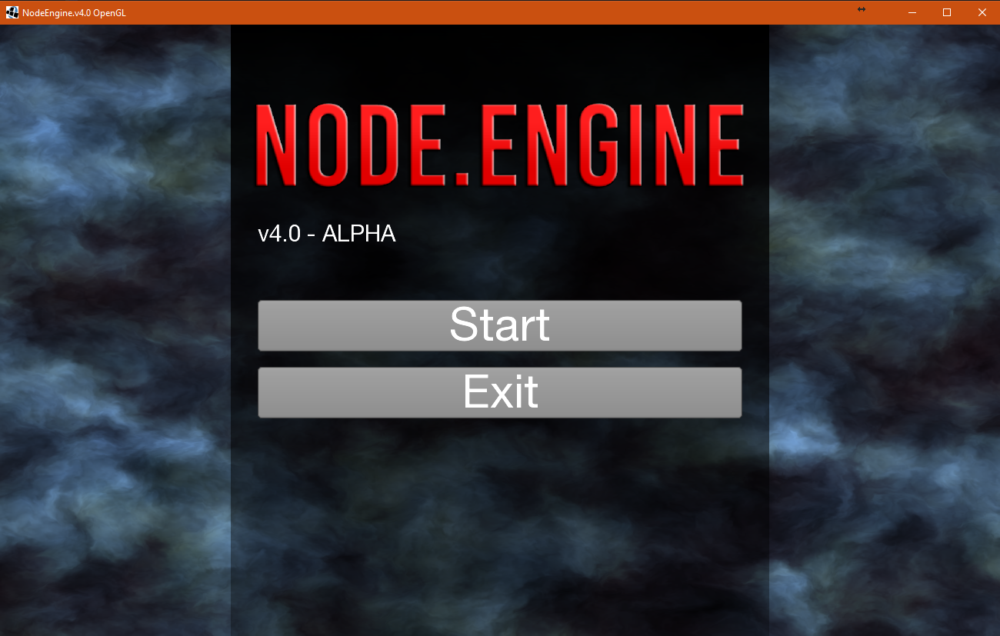
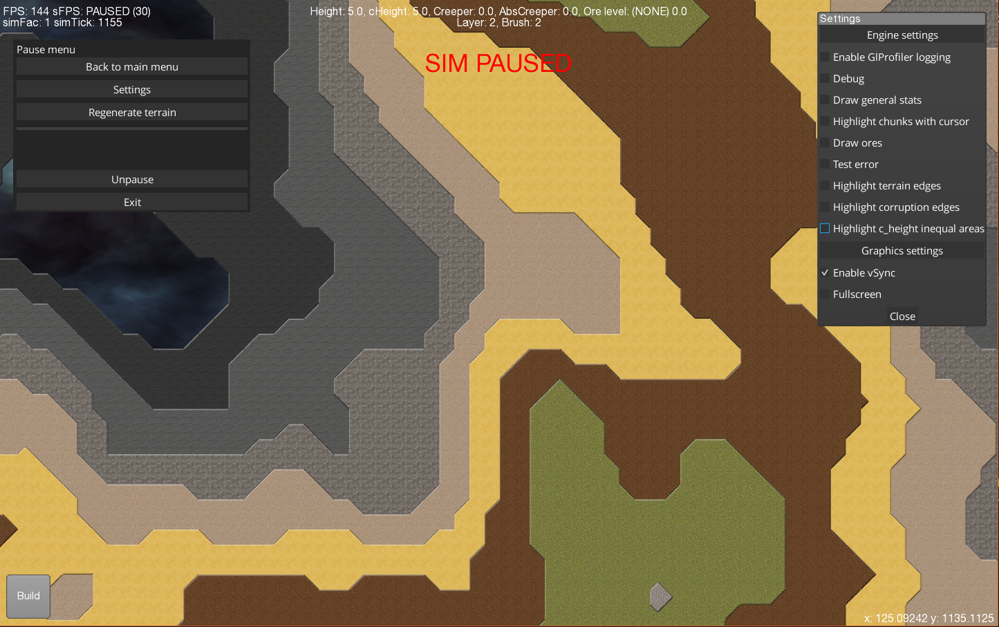
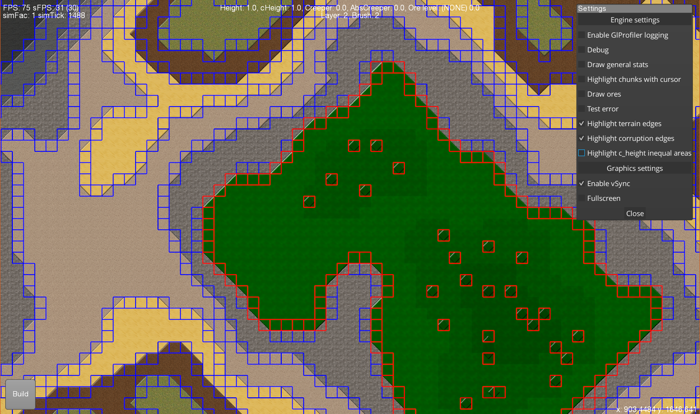
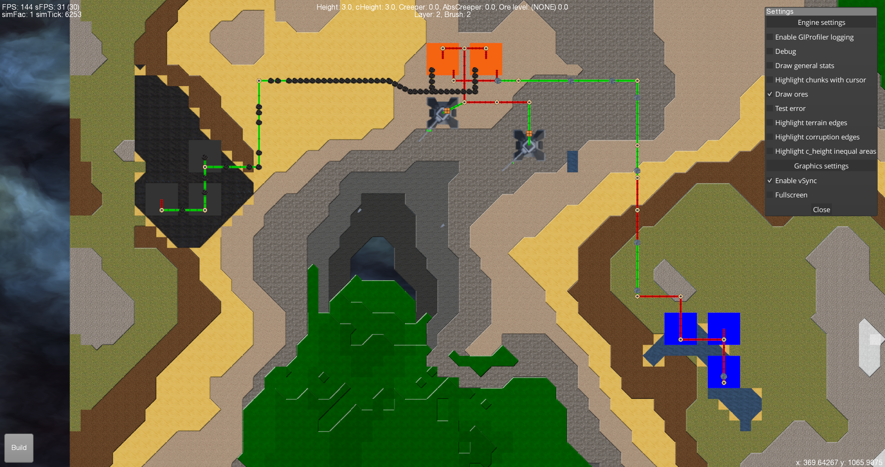
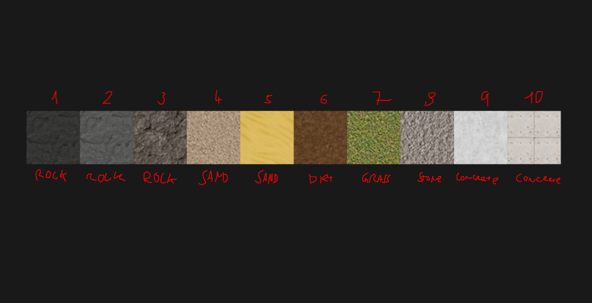
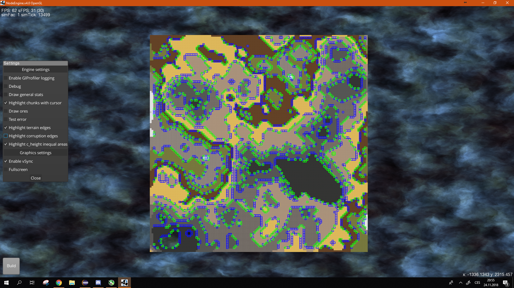

Author: Dan Rakusan (DUDSS) 

Currently building a prototype game engine from scratch for a RTS genre game.
Heavily inspired by Creeper World by KnuckleCracker and Factorio.

OpenGL renderer Java adaptation and some basic game functionality stands on the LibGdx framework (Low-level opengl calls based on LWJGL)

Project originally began in the beginning of 2018 (January) as a Java2D testing ground for theory of graphs. I eventually developed a package system that could transfer items along graphs.
In June I ported the project to LibGDX to use the LWJGL (LightWeightJavaGameLibrary) OpenGL rendering. I kept working on the project and in the middle of September I committed the v1.00 version
with the first terrain map concept. First chunks and sections were created and terrain loading optimisations. Later, effective grid mesh rendering developed together with proper terrain and corruption rendering 
and texturing techniques.

* * *
* Current versions main features:
	* Buildings (mines, storages and connectors (that have nodes of either side) and turrets that shoot projectiles)
	
	* Corruption/Creeper, an abstract enemy creeping through the world. Has basic behaviour and a rather complex generation and rendering system. Supports multiple layers and has differenty shaded textures for each one.

	* Randomly generated terrain that has different heights, smooth edges and interacts with corruption.
	
	* Ore generation.

	* Working package system (conveyors, connectors, items, building interconnection, resource handling and production).

	* Few different types of nodes that handle items (Input node, Output node) (Buildings are made up from nodes), part of the package system.

	* A lightweight UI and crash reporting.
	
	* Everything updated by a main simulation loop that runs on a seperate simulation thread. This allows features like pause menu and simulation speed control.

* * *

