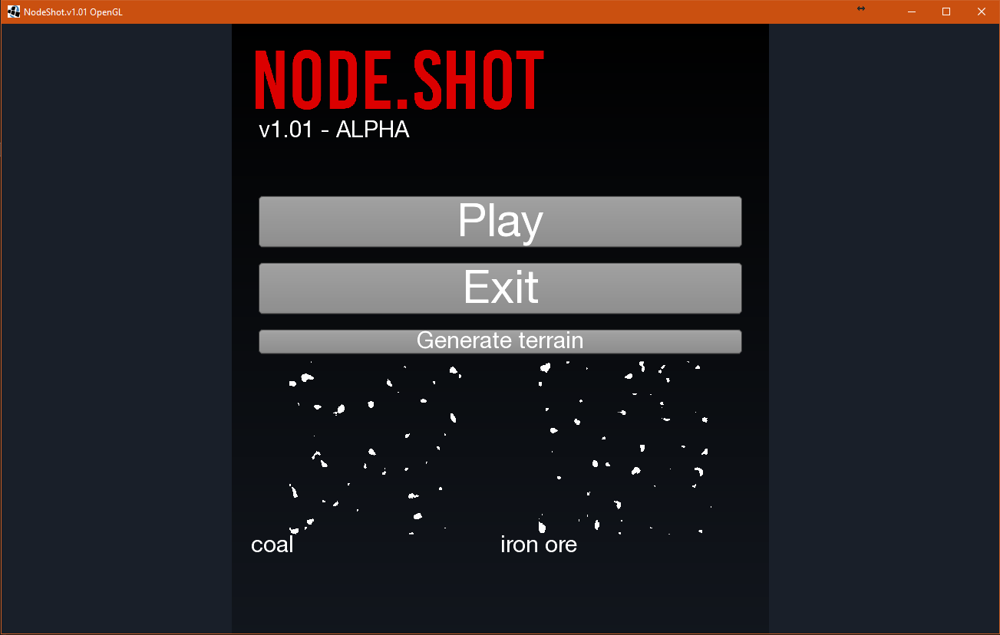

Author: Dan Rakušan (DUDSS) Project began: Beginning of 2018 (January), old Java2D BitBucket repository created on: 23.6.2018

A prototype engine for a possible WIP towerdefense/RTS game.

OpenGL renderer Java adaptation and some basic game functionality stands on the LibGdx framework (Low-level opengl calls based on LWJGL)

