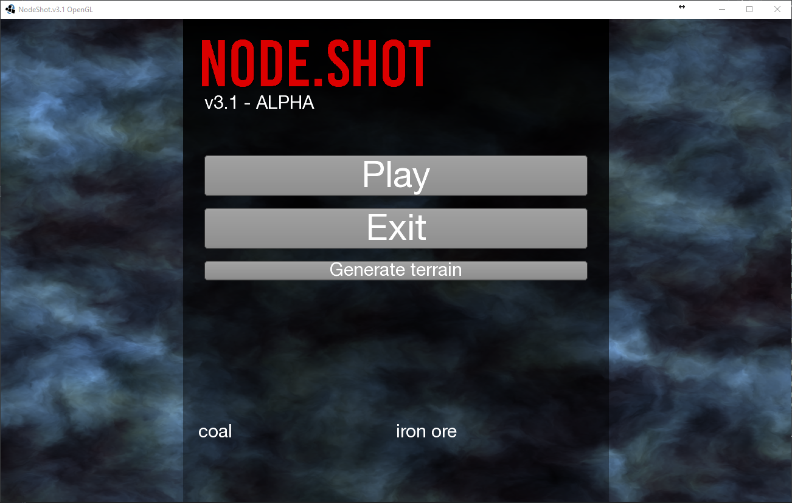
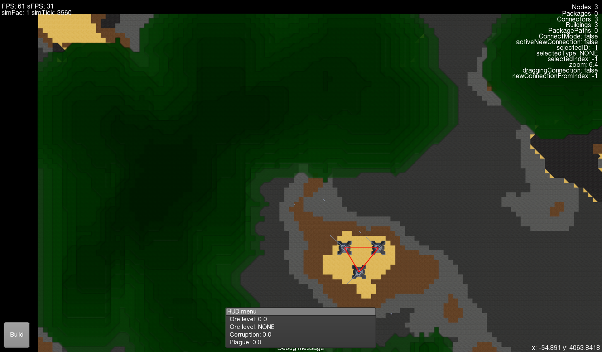
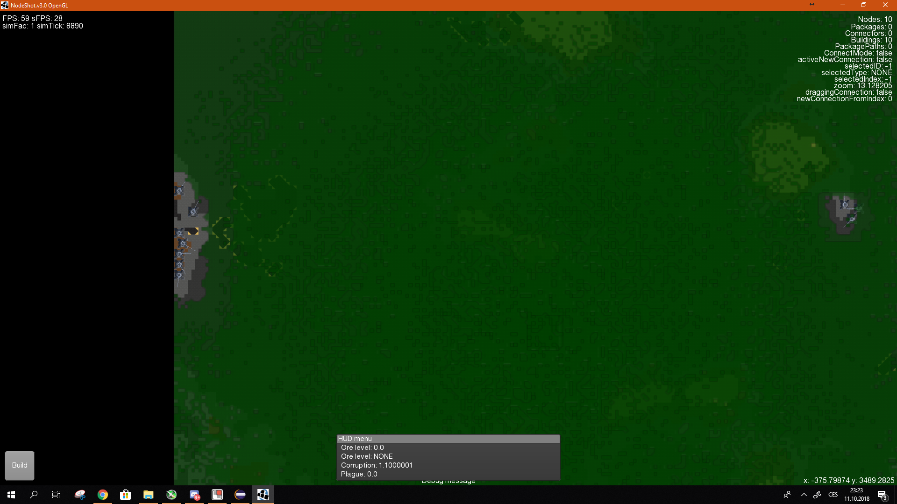
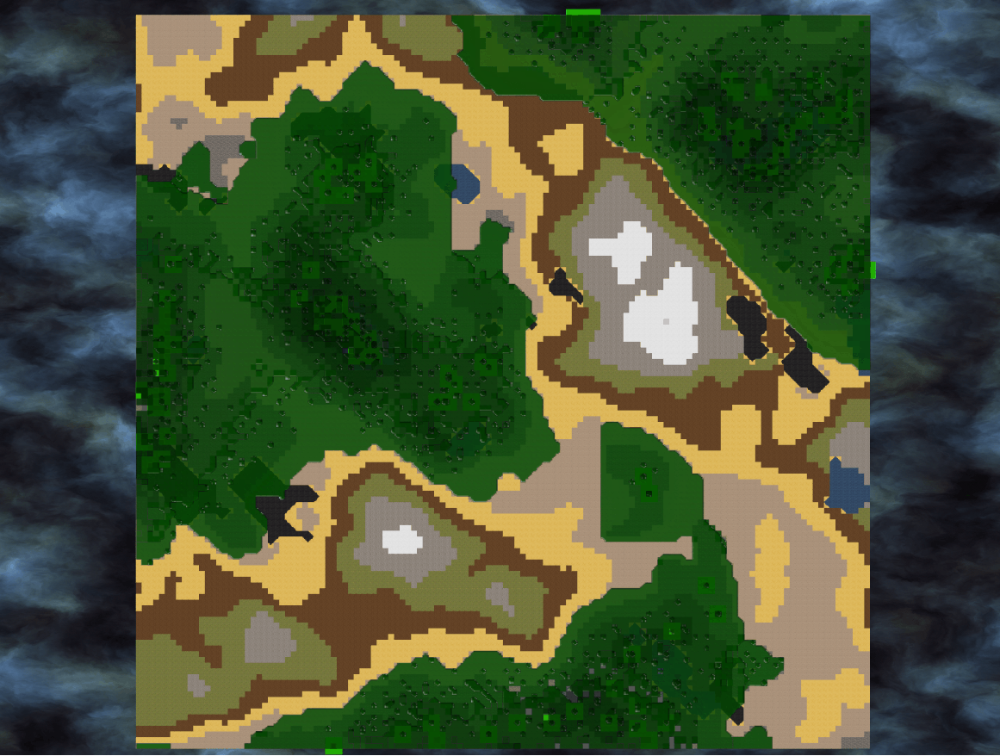
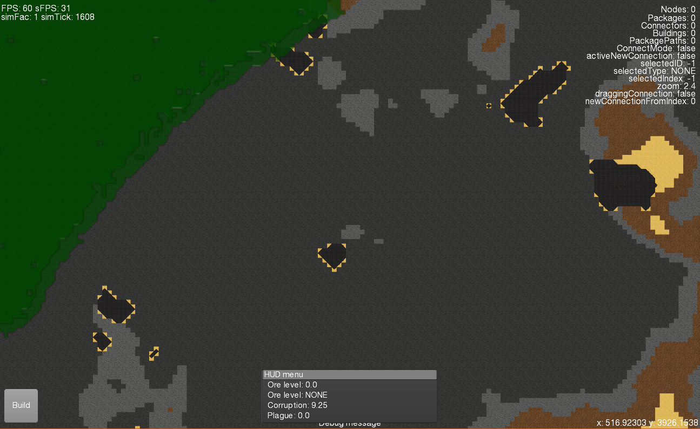
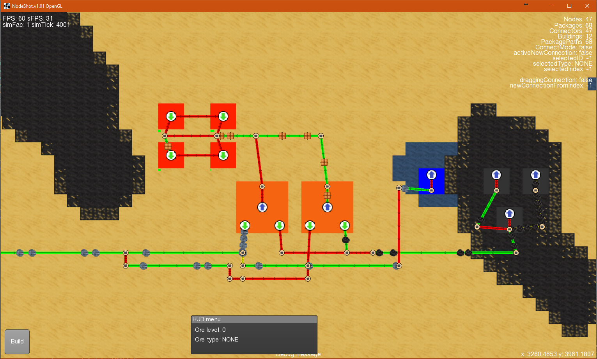
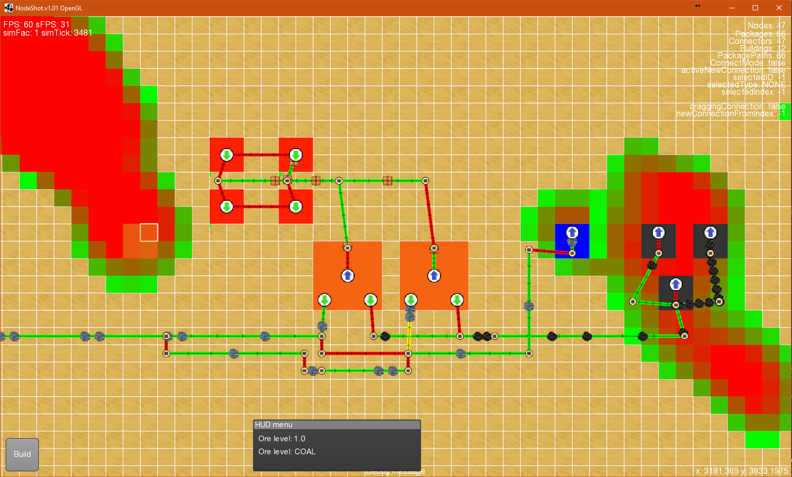
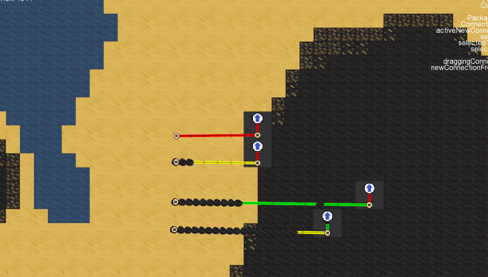
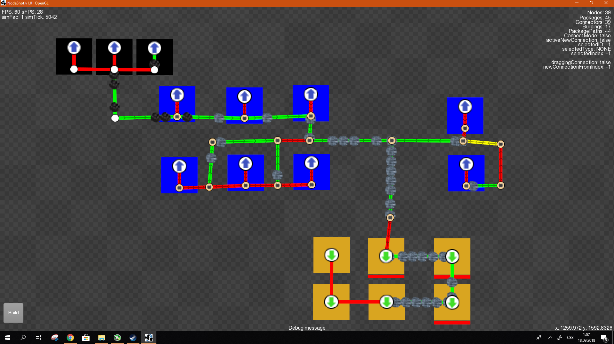
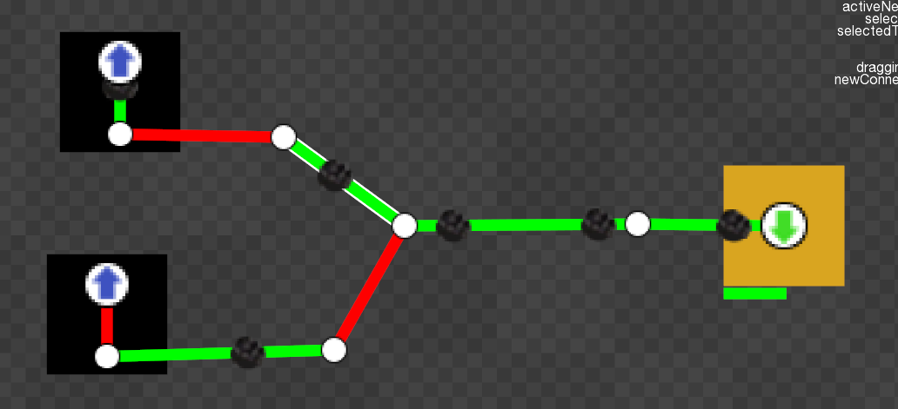

Author: Dan Rakusan (DUDSS) Project began: Beginning of 2018 (January), old Java2D BitBucket repository created on: 23.6.2018

Currently building a prototype game engine from scratch for a RTS genre game.
Heavily inspired by Creeper World by KnuckleCracker and Factorio.

OpenGL renderer Java adaptation and some basic game functionality stands on the LibGdx framework (Low-level opengl calls based on LWJGL)

* * *
* Current version includes:
	* Buildings (mines, storages and connectors (that have nodes of either side) and turrets that shoot projectiles)
	
	* Corruption/Creeper, an abstract enemy creeping through the world. Has basic behaviour and a rather complex generation and rendering system. Supports multiple layers and has differenty shaded textures for each one.

	* Randomly generated terrain, ore spawning and terrain height. (Simplex noise gen)

	* Working package system (packages follow connectors)
		
	* Items (in form of packages)
	
	* Few different types of nodes that handle items (Input node, Output node) (Buildings are made up from nodes)
	
	* 2 package pathfinding schemes (conveyor belt and shortest path)

	* A semi-working UI

* * *

